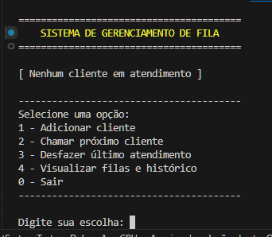

# Sistema de Gerenciamento de Fila com Prioridade Dinâmica

Este projeto consiste em uma **API para gerenciamento de filas de atendimento**, baseada em uma regra de prioridade dinâmica (3:1), que combina **ordem de chegada** com **prioridade preferencial**.

A aplicação foi projetada para simular cenários reais de atendimento, como:

* Bancos
* Hospitais
* Serviços públicos
* Estabelecimentos comerciais (padarias, lanchonetes, gráficas, etc.)

---

## Problema Resolvido

Em muitos sistemas de fila, a prioridade de atendimento não é tratada corretamente ou é aplicada de forma rígida, podendo gerar:

* Atendimento injusto
* Quebra da ordem de chegada
* Falta de equilíbrio entre clientes comuns e preferenciais

Este sistema resolve esse problema ao aplicar uma abordagem híbrida:

* Mantém a **ordem de chegada (FIFO)**
* Garante prioridade a cada **3 atendimentos comuns**
* Evita inconsistências utilizando o **histórico como fonte de verdade**, em vez de contadores

---

## Regra de Negócio

O sistema trabalha com dois tipos de clientes:

* **Comum**
* **Prioridade**

A lógica de atendimento segue:

* Clientes são atendidos respeitando a ordem de chegada
* Após **3 atendimentos consecutivos de clientes comuns**, o próximo atendimento deve ser **prioritário**, caso exista
* Caso não haja cliente prioritário disponível, o fluxo continua normalmente

Essa regra garante um equilíbrio entre **justiça** e **prioridade**, tornando o comportamento mais próximo de sistemas reais.

---

## Diferencial do Projeto

O principal diferencial está na forma como a prioridade é controlada:

* Não utiliza contadores fixos (propensos a inconsistência)
* Utiliza o **histórico de atendimentos como fonte de verdade**
* Regra isolada em uma **Policy desacoplada**
* Arquitetura preparada para evolução (API, testes, persistência futura)

---

## Objetivo do Projeto

Este projeto foi desenvolvido como parte do processo de aprendizado em backend com C#, com foco em:

* Construção de APIs com ASP.NET
* Aplicação de **injeção de dependência**
* Separação de responsabilidades (arquitetura em camadas)
* Escrita de **testes unitários com xUnit e Moq**
* Evolução incremental do sistema (Console → Core → API → Testes → futura infraestrutura)

O desenvolvimento foi conduzido de forma autodidata, com apoio de documentação oficial, vídeos e ferramentas de IA.

---

## Resumo do Projeto

Sistema de fila dinâmica que utiliza **histórico de atendimentos e ordem de chegada** para determinar a sequência de clientes, sendo aplicável a diversos cenários reais de negócio.

---

## Endpoints da API

A API expõe endpoints responsáveis por gerenciar o fluxo da fila e o histórico de atendimentos:

### Criar cliente

**POST /api/queue/client**

Adiciona um novo cliente à fila, respeitando validações de nome e tipo.

---

###  Chamar próximo

**POST /api/queue/call-next**

Realiza o atendimento do próximo cliente com base na regra de prioridade dinâmica.

---

### Obter estado da fila

**GET /api/queue/get-queue-state**

Retorna o estado atual do sistema, incluindo:

* Clientes comuns na fila
* Clientes prioritários na fila
* Histórico de atendimentos

---

###  Desfazer último atendimento

**POST /api/queue/undo**

Remove o último atendimento do histórico e retorna o cliente para a fila.

---

## Arquitetura da Solução

O projeto foi estruturado em múltiplos projetos dentro de uma Solution, seguindo o princípio de separação de responsabilidades:

```
QueueManagementSystem
│
├── API
│   └── Controllers (exposição dos endpoints)
│   └── DTOs
│   └── Middleware
│
├── Core
│   ├── Enums
│   ├── Interfaces
│   ├── Models
│   ├── Policies
│   └── Services
│
├── Console
│   └── UI (interface de interação via terminal)
│
├── Infrastructure
│   └── Repositories
│
├── Tests
│   ├── CallOrderPolicyTests.cs
│   ├── ClientTests.cs
│   ├── InMemoryQueuRepositoryTests.cs
│   └── QueueServiceTests.cs
```

---

## Fluxo da Aplicação

A aplicação segue um fluxo bem definido entre as camadas:

```
Middleware → Controller → Service → Policy → Repository
```

### Responsabilidades:

* **Middleware** → intercepta requisições e trata exceções
* **Controller** → recebe requisições HTTP e retorna respostas
* **Service** → orquestra a lógica de negócio
* **Policy** → define a regra de decisão de atendimento
* **Repository** → gerencia os dados em memória

---

## Tratamento de Exceções

A aplicação utiliza um middleware global para tratamento de erros, garantindo respostas padronizadas.

### Funcionamento

* Intercepta todas as requisições da aplicação
* Executa o pipeline normalmente
* Em caso de exceção, captura e trata o erro

### Regras de resposta

* **ArgumentException**
  → erro causado por entrada inválida do usuário
  → retorna **HTTP 400 (Bad Request)**

* **Demais exceções**
  → erros internos da aplicação
  → retorna **HTTP 500 (Internal Server Error)**

### Formato de resposta

```json
{
  "message": "Descrição do erro",
  "status": 400
}
```

Essa abordagem garante:

* Respostas consistentes
* Maior segurança (sem exposição de stack trace)
* Melhor experiência para consumo da API

---

## DTOs e Mapeamento

Para garantir separação entre domínio e camada de apresentação, o projeto utiliza **DTOs (Data Transfer Objects)**.

### DTOs implementados:

* **ClientResponse** → representa o cliente retornado pela API
* **CreateClientRequest** → representa os dados necessários para criação
* **QueueStateResponse** → representa o estado completo da fila
* **Mapper** → responsável por converter entidades de domínio em DTOs

### Estratégia adotada:

* O **ID da entidade não é exposto** na API
* O `ClientType` (enum) é convertido para **string**, tornando a resposta mais legível
* Uso de método estático para centralizar o mapeamento

Essa abordagem garante:

* Controle sobre os dados expostos
* Independência entre domínio e API
* Maior clareza nas respostas

---

## Testes Unitários

O projeto possui testes unitários focados em validar o comportamento de cada camada de forma isolada.

### Estratégia:

* Testes independentes por classe
* Uso de **Moq** para simular dependências
* Validação de regras de negócio e cenários reais

### Cobertura:

* **Entidades (Client)** → validação de estado e regras
* **Policy (CallOrderPolicy)** → decisão de prioridade baseada em histórico
* **Service (QueueService)** → fluxo da aplicação e regras de negócio
* **Repository** → operações de armazenamento em memória

O foco principal dos testes é garantir **consistência das regras mesmo após refatorações**.

---

## Tecnologias Utilizadas

* C#
* .NET
* ASP.NET Web API
* xUnit
* Moq

---

## Como Executar o Projeto

### Executar API

```bash id="run-api"
dotnet run
```

Após iniciar, acesse o Swagger no navegador:

```text id="swagger-url"
https://localhost:{porta}/swagger
```

---

### Executar versão Console

```bash id="run-console"
dotnet run
```

---

### Executar testes

```bash id="run-tests"
dotnet test
```

---

## Interface do Sistema

### Menu Console




---

## Evolução do Projeto

O projeto foi desenvolvido de forma incremental:

### Versão inicial

* Aplicação console
* Uso de Queue e Stack
* Controle de prioridade por contador

---

### Refatoração

* Migração para List
* Introdução de arquitetura em camadas
* Remoção de contador

---

### Versão atual

* API REST com ASP.NET
* Uso de DTOs e Mapper
* Middleware de tratamento de exceções
* Testes unitários com isolamento

---

### Próximos passos

* Persistência com banco de dados (SQLite + Entity Framework)
* Criação da camada Infrastructure
* Logs e monitoramento
* Versionamento da API

---

## Autor

Desenvolvido por **Manoel Americo** como parte do processo de evolução em backend com C#.

